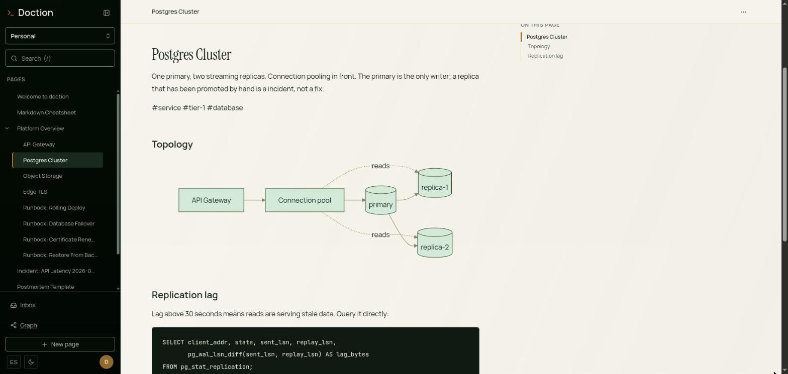
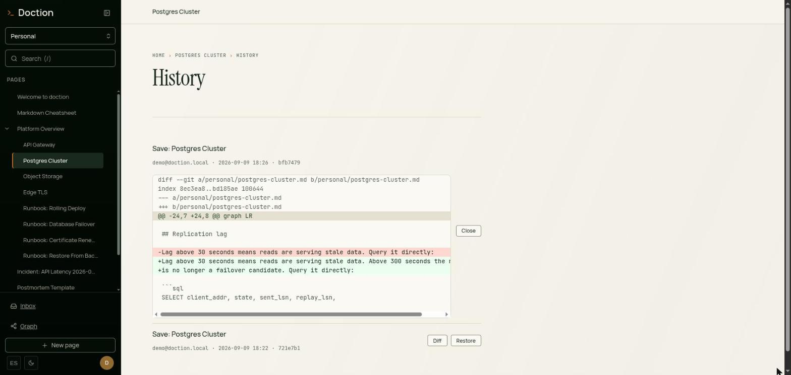

# doction

[](https://github.com/dny1020/doction/actions/workflows/ci.yaml)

[](LICENSE)
[](https://github.com/dny1020/doction/pkgs/container/doction)

A self-hosted, markdown-first wiki and knowledge base built for humans **and** AI agents.
Markdown pages with per-page git history, PostgreSQL full-text search plus optional local
semantic search, a REST API, and a **native MCP server** to plug agents in. Runs as an app
container + a Postgres container — no API keys, no SaaS, no LLM inside doction itself.

> **Why doction?** Unix-style and boring by design. Your notes are plain markdown in a git
> repo; search runs locally; agents talk to it over a standard MCP interface. doction does
> *retrieval* — the language model lives in your agent, not here.



Every save is a git commit, so any page's history is a real diff:



---

## Quick start

```bash
cp .env.example .env   # edit POSTGRES_PASSWORD and SECRET_KEY
mkdir -p data/logs     # the container runs non-root as uid 1000
docker compose up      # then open http://localhost:8000 and register
```

Sign-up is open by default: register your own account, then set `DISABLE_REGISTRATION=1`
and restart. Connecting an agent is one command with a personal access token:

```bash
claude mcp add --transport http doction $DOCTION/api/mcp \
  --header "Authorization: Bearer doction_..."
```

## Documentation

Features, how it works and the map of every page are in [`docs/`](docs/index.md), which is
published at [doction.site](https://doction.site/). Development setup and the check gate are
in [CONTRIBUTING.md](CONTRIBUTING.md), the security model and reporting channel in
[SECURITY.md](SECURITY.md), and release notes in [CHANGELOG.md](CHANGELOG.md).

## License

GNU Affero General Public License v3.0 only — see [LICENSE](LICENSE).

doction is free software: you can redistribute it and modify it under the terms of the GNU
Affero General Public License, version 3, as published by the Free Software Foundation. It
is distributed in the hope that it will be useful, but WITHOUT ANY WARRANTY, without even
the implied warranty of MERCHANTABILITY or FITNESS FOR A PARTICULAR PURPOSE.

An operator who **modifies** doction and lets other people use it over a network owes those
users the modified source; running it unmodified, or modified for yourself or your team,
triggers nothing. The cases and the `SOURCE_URL` setting that surfaces the offer are in
[Configuration](docs/configuration.md#licence-compliance).

### Previous releases

Relicensing is not retroactive. Releases through 0.31.3 were published under MIT and 0.31.4
under GPL-3.0-only; both grants stand, and anyone who received those versions keeps those
terms. AGPL-3.0-only applies from 0.31.5 onwards.

### Dependencies

The bundled dependencies keep their own licences, all compatible with AGPL-3.0: MIT, BSD,
ISC, Apache-2.0, MPL-2.0, Blue Oak 1.0.0, CC0, and LGPL-3.0-only for `psycopg`.
